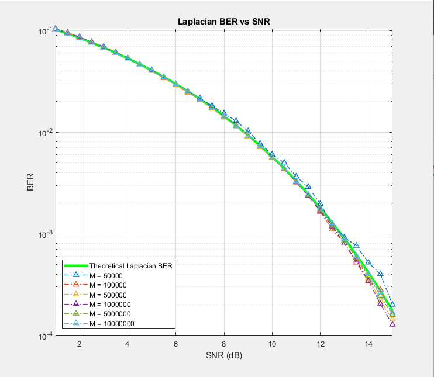

# ECE 131A Project 19F

Create a random binary symmetric transmission channel, introduce different noise corruptions into the channel, plot the **bit-error rate** relative to the **signal-noise ratio**, and compare the simulated results to a calculated theoretical BER/SNR plot.

When the noise introduced into the channel is Gaussian, we get the following BER/SNR plot:

When the noise introduced into the channel is Laplacian, we get the following BER/SNR plot:

Superimposed, we can note the differences in BER/SNR for each channel:

